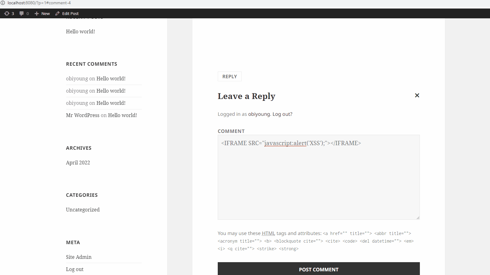
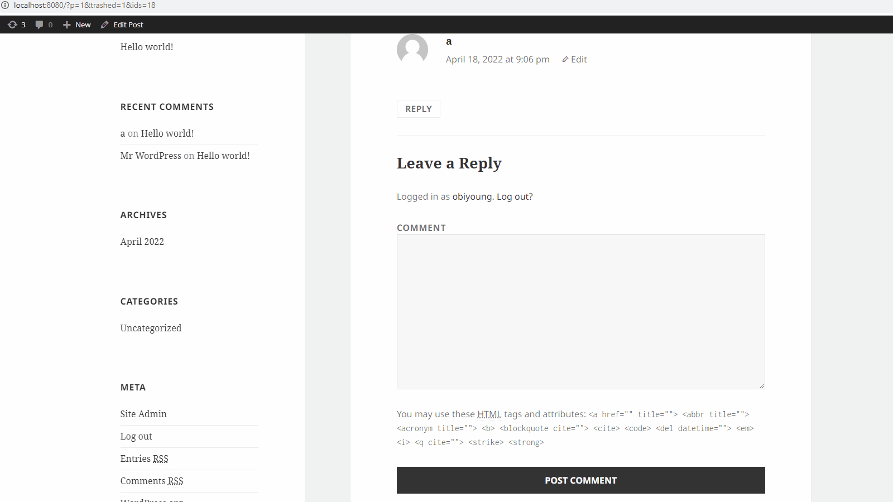

# Project 7 - WordPress Pentesting

Time spent: **X** hours spent in total

> Objective: Find, analyze, recreate, and document **five vulnerabilities** affecting an old version of WordPress

## Pentesting Report

### 1. Cross Site Scripting Vulnerability #1
  - [ ] Summary: In my pentesting WordPress environment, I input some cross site scripting lines of code in the comment box to get a pop up alert on the top of my browser.
    - Vulnerability types: Cross Site Scriptinng 
    - Tested in version: 4.1
    - Fixed in version: 4.5
  - [ ] GIF Walkthrough: 
  - [ ] Steps to recreate: First, go to the home page, from there we can access the comments for the website and choose to leave our own comment. 
I tried a couple of XSS lines and when I entered <IFRAME SRC="javascript:alert('XSS');"></IFRAME>.
I hit submit and when it was loading a new page my XSS alert that said "XSS" popped on the top of the screen.
  - [ ] Affected source code:
    - [Link 1](https://core.trac.wordpress.org/browser/tags/version/src/source_file.php)
### 2. Cross Site Scripting Vulnerability #2
  - [ ] Summary: In my pentesting WordPress environment, I input some cross site scripting lines of code in the comment box that when excecuted the comments page contains fields to input your name and email address that were not there before. Other users can enter information into these input fields and if the attacker entered a site that can redirect this information to their own page it can be very dangerous.
    - Vulnerability types: Cross Site Scripting
    - Tested in version: 4.1 
    - Fixed in version: 4.5 
  - [ ] GIF Walkthrough: 
  - [ ] Steps to recreate: First, go to the home page, from there we can access the comments for the website and choose to leave our own comment. I entered lines of code that would create input fields <form action="/url/profile.php" method="post"><input type="text" name="firstname"/>
<input type="text" name="lastname"/>
 
<input type="text" name="email"/>
<input type="submit" name="submit" value="Update"/>
</form>. I hit submit and the input fields appeared in the comment section and users were able to input information.

  - [ ] Affected source code:
    - [Link 1](https://core.trac.wordpress.org/browser/tags/version/src/source_file.php)
### 3. (Required) Vulnerability Name or ID
  - [ ] Summary: 
    - Vulnerability types:
    - Tested in version:
    - Fixed in version: 
  - [ ] GIF Walkthrough: 
  - [ ] Steps to recreate: 
  - [ ] Affected source code:
    - [Link 1](https://core.trac.wordpress.org/browser/tags/version/src/source_file.php)
### 4. (Optional) Vulnerability Name or ID
  - [ ] Summary: 
    - Vulnerability types:
    - Tested in version:
    - Fixed in version: 
  - [ ] GIF Walkthrough: 
  - [ ] Steps to recreate: 
  - [ ] Affected source code:
    - [Link 1](https://core.trac.wordpress.org/browser/tags/version/src/source_file.php)
### 5. (Optional) Vulnerability Name or ID
  - [ ] Summary: 
    - Vulnerability types:
    - Tested in version:
    - Fixed in version: 
  - [ ] GIF Walkthrough: 
  - [ ] Steps to recreate: 
  - [ ] Affected source code:
    - [Link 1](https://core.trac.wordpress.org/browser/tags/version/src/source_file.php) 

## Assets

List any additional assets, such as scripts or files

## Resources

- [WordPress Source Browser](https://core.trac.wordpress.org/browser/)
- [WordPress Developer Reference](https://developer.wordpress.org/reference/)

GIFs created with [LiceCap](http://www.cockos.com/licecap/).

## Notes

Describe any challenges encountered while doing the work

## License

    Copyright [yyyy] [name of copyright owner]

    Licensed under the Apache License, Version 2.0 (the "License");
    you may not use this file except in compliance with the License.
    You may obtain a copy of the License at

        http://www.apache.org/licenses/LICENSE-2.0

    Unless required by applicable law or agreed to in writing, software
    distributed under the License is distributed on an "AS IS" BASIS,
    WITHOUT WARRANTIES OR CONDITIONS OF ANY KIND, either express or implied.
    See the License for the specific language governing permissions and
    limitations under the License.
