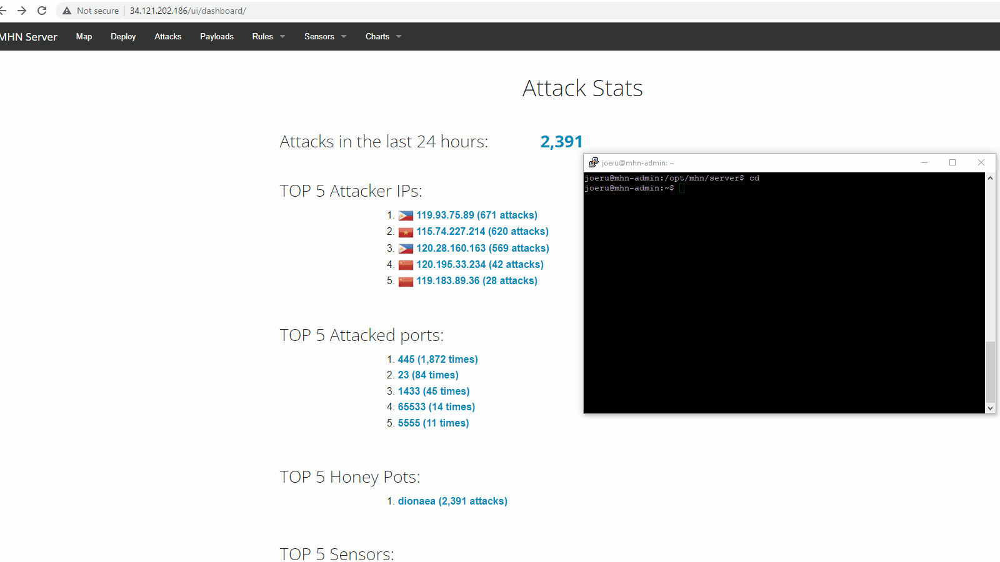
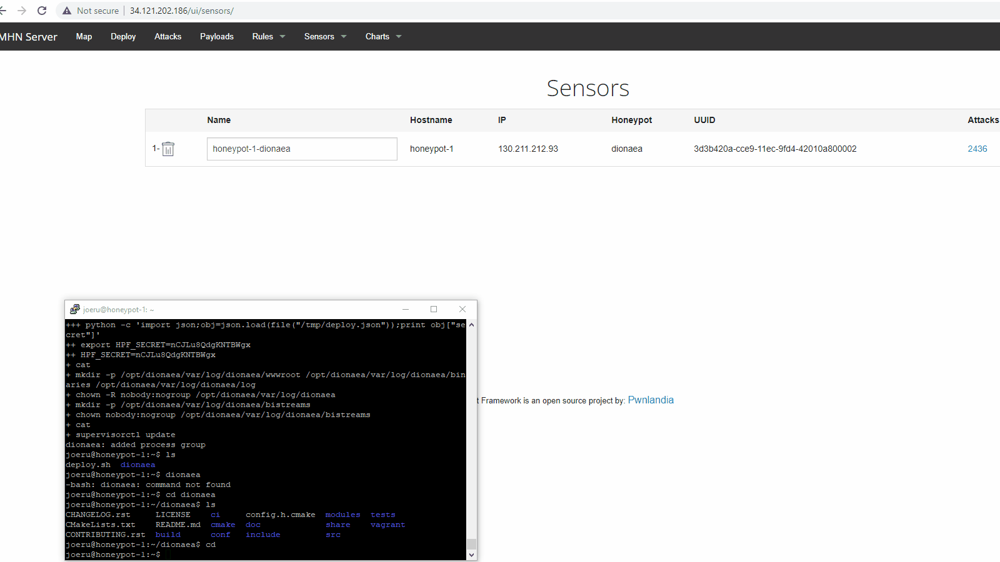

# Honeypot Assignment

**Time spent:** **10** hours spent in total

**Objective:** I created a honeypot using MHN-Admin. After reading this you will see how the current state of the of the internet stands and why cybersecurity is one of the most important parts of a company. Our IT security team needs all the resources that they can get to defend against these attacks.

### MHN-Admin Deployment (Required)

**Summary:** I deployed the MHN-Admin through Google Cloud Provider services. After having my honeypot online for just 2 hours, it received over 2,300 attacks. This is the current state of the internet and networks all across the globe are being targeted. 

### Dionaea Honeypot Deployment (Required)

**Summary:** Dionaea comes from the carnivorous plant the venus flytrap which captures insects that lands on them, and that is exactly what our Dionaea honeypot does but with malware. The Dionaea honeypot traps malware that attack the honeypot. 

### Database Backup (Required) 

**Summary:** What is the RDBMS that MHN-Admin uses? What information does the exported JSON file record? 
The RDBMS that MHN-Admin uses is MongoDB. The information that the exported JSON file records is the id of the attacker, the protocol the attacker used, hpfeed id, timestamp and date of the attack, the attacker's ip, source and destination ports, the type of honeypot used. 

*Be sure to upload session.json directly to this GitHub repo/branch in order to get full credit.*
