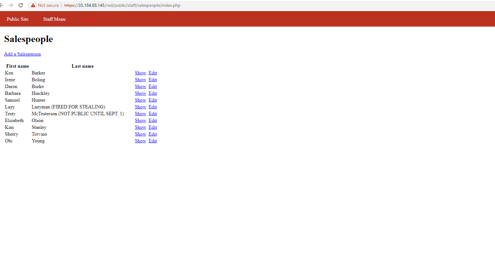

# Project 9 - Pentesting Live Targets

Time spent: **5** hours spent in total

> Objective: Identify vulnerabilities in three different versions of the Globitek website: blue, green, and red.

The six possible exploits are:

* Username Enumeration
* Insecure Direct Object Reference (IDOR)
* SQL Injection (SQLi)
* Cross-Site Scripting (XSS)
* Cross-Site Request Forgery (CSRF)
* Session Hijacking/Fixation

Each color is vulnerable to only 2 of the 6 possible exploits. First discover which color has the specific vulnerability, then write a short description of how to exploit it, and finally demonstrate it using screenshots compiled into a GIF.

## Blue

Vulnerability #1: SQL Injection. When I was on the editing a salesperson page I inserted 'or1=1' into the url right next to the id=# and when the page loaded it gave me a error that said "Database query failed" signifying that SQL was processed. 

Description:  When I was on the editing a salesperson page I inserted 'or1=1' into the url right next to the id=# and when the page loaded it gave me a error that said "Database query failed" signifying that SQL was processed. 

Vulnerability #2: Session Hijack

Description: Copy the PHP session id from the logged in user and paste it to the attackers browser PHP session id. Then you are logged in on the attackers browser and you hijacked the target's session. 

## Green

Vulnerability #1: Cross Site Scripting (XSS) 

Description: In the feedback section, I inserted a script  that is displayed when a user is logged in and they check the feedback section. 

Vulnerability #2: User Enumeration 

Description: The developers made a mistake on the log in page by putting the error message "Log in was unsuccessful" in bold when the username account exists and if the username account does not exist it is unbolded. 

## Red

Vulnerability #1: IDOR

Description: On the sales person page we can change the id in the url to transport us to any sales person in the database, even though we are not logged in users we can see sales person names that are not listed for us to see. 

Vulnerability #2: CSRF

Description: Made a html script that changes a sales person to Obi Young when the link is opened on a logged in user's browser. 

## Notes

